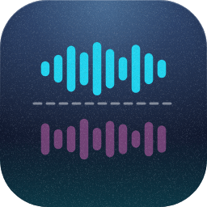
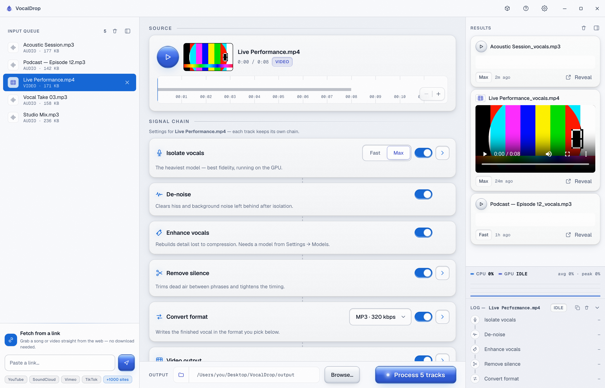
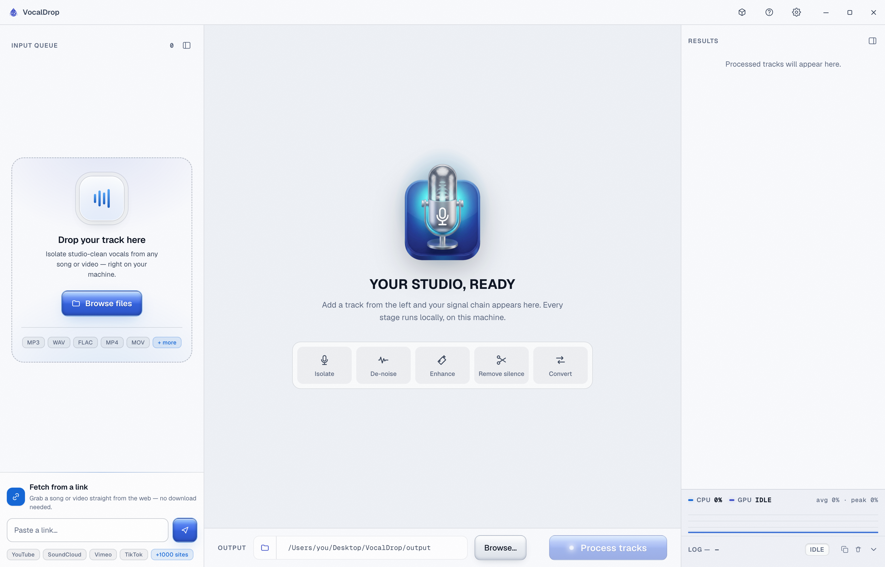

<!-- The hero and press blocks below are GENERATED from lib/products.ts in the
     abd3lraouf.dev repo (scripts/sync-product-readme.ts) — edit the product
     record there, not here. The markers must survive into the public repo: the
     release workflow copies this file over that README wholesale, and when this
     file had no markers the copy silently deleted the generated blocks on every
     release. Everything outside the markers is hand-written and stays. -->
<!-- BEGIN abd3lraouf-studios:hero -->

    

<h1 align="center">VocalDrop — Free AI Vocal Isolator & Extractor</h1>

    <strong>Lifts a studio-clean vocal out of any song, on your own CPU or GPU. The acapella you wanted, and your audio never leaves the machine.</strong> 
    macOS (Apple Silicon) · Windows · Linux · Free

    <a href="https://github.com/abd3lraouf-studios/vocaldrop/releases/latest"><strong>Download — macOS, Windows, Linux →</strong></a>

    <a href="https://abd3lraouf.dev/projects/vocaldrop/">abd3lraouf.dev/projects/vocaldrop/</a>

<!-- END abd3lraouf-studios:hero -->

  
  
  
  
  
  

  <a href="#-what-it-does">What it does</a> ·
  <a href="#-the-app">The app</a> ·
  <a href="#-install">Install</a> ·
  <a href="#-how-it-works">How it works</a> ·
  <a href="#-vs-other-tools">vs. other tools</a> ·
  <a href="#-faq">FAQ</a>

---

**VocalDrop** is a free **AI vocal isolator** that **extracts the vocals from any song** on your own computer. Drop in a track, a video, or a link, and a **RoFormer** neural model lifts out a clean **vocal stem** — a ready-to-use **acapella**, good enough to sample, remix or edit against.

The voice is the point. The **instrumental** falls out of the same pass for free, so if a karaoke bed is what you're after it doubles as a **vocal remover** — but it is built to keep the vocal, not to throw it away.

It is a real desktop app, not a web uploader: **your audio never leaves the machine**, there is no sign-up, no track limit, and nothing is watermarked. The Python engine ships inside the installer; the model for your quality tier downloads on first use (~100 MB Fast, ~600 MB Max — ~1 GB for the whole catalog); after that VocalDrop works with no connection at all.

## ✨ What it does

**Isolate vocals — two modes, one model each.**
**Fast** runs BS-PolarFormer, a compact GPU-friendly model that turns a track around in seconds on Apple Silicon. **Max** runs BS-Roformer 1296 for the highest fidelity when you care more about the result than the clock. There is no ensemble and no blending: one model per mode, so what you hear is what that model produced.

**And the instrumental, free.** Every separation can write both sides. The acapella is what the app is for; the backing track comes out of the same run at no extra cost, so a karaoke bed is a side effect rather than a second job.

**Clean it up.** Optional **de-noise** (a MelBand RoFormer pass) strips residual hiss and bleed, and optional **AI vocal restoration** (Apollo) repairs a vocal that came out of a lossy or damaged source.

**How good is the separation?** The models, ranked by measured quality:

| | Model | Size | Vocal quality | Speed |
|---|---|---|---|---|
| **Max** | BS-Roformer 1296 (viperx) | 609 MB | ★★★★★ — ~12.96 SDR, the community benchmark | slower (~10 min/song on CPU, seconds on GPU) |
| **Fast** | BS-PolarFormer | 97 MB | ★★★★☆ — ~11.5 SDR, 80% of Max at 10× speed | seconds on GPU |
| *(DML Fast)* | Kim Vocal 2 (MDX) | 66 MB | ★★★☆☆ — ~9.8 SDR, best ONNX model | seconds on AMD/Intel GPU |

*(SDR = Signal-to-Distortion Ratio, from [MVSEP benchmarks](https://mvsep.com/quality_checker/leaderboard) — higher is better.)* Both tiers use the RoFormer architecture — the same family UVR5 ships — and are the highest-quality open-source separation models available today.

**Chain the whole job.** Isolate → de-noise → enhance → remove silence → convert, applied per track, in a single run. Silence removal uses adaptive detection with click-free crossfade welding, which is what you want on podcasts, lectures and live takes.

**Bring in audio from anywhere.** Drop files, drop a folder, or paste a **link** — VocalDrop fetches from YouTube, SoundCloud, Vimeo, TikTok and a thousand-odd other sites, showing the real title, thumbnail, size, speed and ETA while it downloads. You can also hand it a link from outside the app via a `vocaldrop://` URL.

**Video in, video out.** Drop a music video or a clip; VocalDrop pulls the audio, separates it, and can re-mux a synced video carrying whichever stem you chose.

**Convert and tag.** Transcode to `mp3`, `wav`, `flac`, `m4a`, `ogg`, `opus` or `aiff`, preserving metadata and cover art.

**Survives a crash.** If the app is force-quit or the machine loses power mid-run, the next launch tells you exactly what was interrupted, offers the finished downloads back, and clears the temporary files the interrupted run left behind.

## 📸 The app

  

<em>One window, the whole workflow.</em> Queue up audio and video together, set the signal chain per track, and watch finished stems land in the Results feed — playable in place, or one click from your file manager.

  

## 📥 Install

Grab the build for your system from the [**latest release**](https://github.com/abd3lraouf-studios/vocaldrop/releases/latest). First use downloads your model once (~100 MB Fast, ~600 MB Max) — everything after that is offline.

### 🍎 macOS · Apple Silicon
Download `VocalDrop-<version>-arm64.dmg`, open it, drag **VocalDrop** to **Applications**.
**First launch:** the build is not notarized yet, so macOS will say it cannot be opened. **Right-click (⌃-click) the app → Open → Open anyway.** You only do this once.

### 🪟 Windows · x64
Download `VocalDrop Setup <version>.exe` and run it.
**First launch:** SmartScreen may warn on an unsigned build — **More info → Run anyway**.

### 🐧 Linux · x64
Download `VocalDrop_<version>_amd64.AppImage`, then `chmod +x` it and run.

> **Verify your download:** every asset ships a matching `.sha256`. Compare with `shasum -a 256` on macOS, or `sha256sum` on Windows and Linux.

**Requirements.** macOS 11+ on Apple Silicon, Windows 10/11 x64, or Linux x64. **ffmpeg and the Python runtime are bundled** — there is nothing else to install, and no Python setup of your own. Budget ~1 GB of disk for the full model set (Fast alone is ~100 MB); an NVIDIA machine adds a one-time ~2.5 GB CUDA download when acceleration is enabled.

## 🧠 How it works

VocalDrop runs the **RoFormer** family of separation models — the same architecture behind the best commercial stem tools — locally, through PyTorch on NVIDIA (CUDA) and Apple Silicon (Metal). AMD/Intel GPUs and machines without a GPU run the **MDX** family on onnxruntime instead (DirectML on Windows AMD/Intel, the optimized CPU engine elsewhere) — the app detects which at launch.

| Track | Fast | Max |
|---|---|---|
| NVIDIA · Apple Silicon | BS-PolarFormer (~97 MB) | BS-Roformer 1296 (~609 MB) |
| AMD/Intel (Windows) · CPU | Kim Vocal 2 (~66 MB) | MDX Inst HQ 3 (~66 MB) |

Post-stages on every track: MelBand De-noise (~870 MB) and the Apollo vocal restorer (~194 MB), both optional, both on by default.

**It uses your GPU wherever there is one.** Apple Silicon runs on Metal (MPS) out of the box. On Windows and Linux the app detects the GPU at launch: an NVIDIA card gets a one-time CUDA install (~2.5 GB, automatic), AMD/Intel GPUs run the MDX model family on DirectML, and everything else runs the optimized CPU engine. Device selection is automatic and can be forced to CPU in Settings.

The app itself is a native shell — a Rust engine driving the system webview, with a self-contained Python runtime alongside it for the model inference. No browser engine is bundled, no local web server is opened, and no Electron.

## 🆚 vs. other tools

Most "free" vocal extractors are websites that **upload your audio to someone else's server**. Here is the honest, dimension-by-dimension picture:

| | **VocalDrop** | [UVR5](https://github.com/Anjok07/ultimatevocalremovergui) | [LALAL.AI](https://lalal.ai) | [MVSEP](https://mvsep.com) | [Moises](https://moises.ai) | [iZotope RX](https://izotope.com/en/products/rx.html) |
|---|:---:|:---:|:---:|:---:|:---:|:---:|
| Runs locally, audio never uploaded | ✅ | ✅ | ❌ uploads | ❌ uploads | ❌ cloud | ✅ |
| Free, unlimited | ✅ | ✅ | ❌ per-minute | ❌ queue-limited | ❌ subscription | ❌ $199+ |
| SOTA separation (RoFormer) | ✅ | ✅ | partial | ✅ | partial | ❌ |
| GPU-accelerated (all vendors) | ✅ Metal · CUDA · DirectML | ⚠️ CUDA only | n/a | n/a | n/a | ✅ |
| Automatic GPU setup | ✅ one-time, in-app | ❌ manual | n/a | n/a | n/a | n/a |
| Signal chain: isolate → denoise → restore → silence → convert | ✅ one pass | ❌ manual chaining | ❌ separation only | ❌ separation only | partial | manual |
| AI vocal restoration (Apollo) | ✅ built-in | ❌ | ❌ | ❌ | ❌ | ❌ |
| Link ingestion (YouTube, 1000+ sites) | ✅ | ❌ | ❌ | ❌ | ❌ | ❌ |
| Video in → synced video out | ✅ | ❌ | ❌ | ❌ | partial | ❌ |
| Native desktop app (no browser) | ✅ | ⚠️ Python GUI | ❌ web | ❌ web | ✅ | ✅ |
| One-click install | ✅ 315 MB | ⚠️ 1.6 GB | n/a | n/a | ✅ | ✅ |
| No account | ✅ | ✅ | ⚠️ required | ⚠️ required | ❌ required | ✅ |
| No watermark | ✅ | ✅ | ❌ free tier | ✅ | ❌ free tier | ✅ |
| New models without app update | ✅ remote catalog | ❌ manual | ✅ server-side | ✅ server-side | ✅ server-side | ❌ |
| Batch / queue processing | ✅ | ⚠️ file list | ❌ | ⚠️ | ❌ | ✅ |

**The short version:** VocalDrop is the only tool that is simultaneously **free**, **local** (your audio never leaves the machine), **GPU-accelerated on every vendor** (Metal on Apple Silicon, CUDA on NVIDIA, DirectML on AMD/Intel — configured automatically), and a **full signal chain** rather than just a separator. UVR5 is the closest open-source alternative but requires Python setup, manual GPU configuration, is CUDA-only, and has no link ingestion or video support. Online tools upload your audio. Paid tools cost money.

Looking for a **free UVR5 alternative**, a **private Moises alternative**, or an **offline acapella extractor that doesn't upload**? That is what this is.

## 🔒 Privacy

**Your audio never leaves your computer.** Separation, conversion and cleanup all run locally.

The app talks to the network in exactly four situations: the one-time engine and model download, fetching a link you paste, the update check (switch it off in Settings), and anonymous diagnostics. Diagnostics are crash reports and coarse usage counts — never file contents, never file paths, never anything you typed. They can be turned off in Settings, and the in-app bug reporter always shows you the exact payload before you send it, with per-attachment toggles.

## ❓ FAQ

**Does it extract vocals, or remove them?**
Both — they are the same operation. Every run separates the track into a vocal stem and an instrumental; keep whichever you came for, or both.

**Is my audio uploaded anywhere?**
No. The first launch downloads the models; after that you can pull the network cable and everything still works.

**Does it use my GPU?**
Yes. Metal on Apple Silicon, automatically. On Windows and Linux the app detects your GPU on launch — NVIDIA gets a one-time CUDA download, AMD/Intel run the MDX models on DirectML, and machines without a GPU run the optimized CPU engine.

**Is it really free?**
Yes. No ads, no watermark, no subscription, no paywalled features, no account. VocalDrop is closed source and simply given away.

**Why the "unidentified developer" or SmartScreen warning?**
The builds are not yet code-signed or notarized. macOS: right-click → Open. Windows: More info → Run anyway. Signing is on the roadmap.

**How is this different from UVR5?**
Same underlying models, very different package: drag-and-drop, link fetching, video support, format conversion, silence removal and crash recovery in one native app, with no Python environment to manage.

**Which platforms?**
macOS 11+ on Apple Silicon, Windows 10/11 x64, Linux x64. There is no Intel-Mac build.

## 🛣️ Roadmap

- [ ] Code-signing and notarization, so there is no Gatekeeper or SmartScreen warning
- [ ] In-app auto-update
- [ ] Preview a separation before committing to a full render
- [ ] More stem targets — drums, bass, piano

## 🤝 Feedback

Bug reports and feature requests are very welcome in the [Issues](https://github.com/abd3lraouf-studios/vocaldrop/issues). The app also has a built-in reporter — **Help → Report a Problem…** — which gathers a diagnostic snapshot and shows you precisely what it will send before anything leaves the machine.

<!-- BEGIN abd3lraouf-studios:press -->
## Press & marketing assets

VocalDrop is a free AI vocal isolator for macOS, Windows and Linux that lifts a studio-clean acapella out of any track, entirely on your own hardware — no upload, no account, no watermark.

**Naming.** Written "VocalDrop" — one word, capital V and D. Never "Vocal Drop" or "Vocaldrop".

The press kit — icons, screen art, boilerplate, the fact sheet and a downloadable
archive — is at **[abd3lraouf.dev/press/vocaldrop/](https://abd3lraouf.dev/press/vocaldrop/)**.
<!-- END abd3lraouf-studios:press -->

## 📄 License & acknowledgements

VocalDrop is free to use, closed source, © 2026 abd3lraouf Studios.

It stands on other people's work:
- The **RoFormer** separation models and their authors
- [**audio-separator**](https://github.com/nomadkaraoke/python-audio-separator) — inference
- [**yt-dlp**](https://github.com/yt-dlp/yt-dlp) — link fetching
- [ffmpeg](https://ffmpeg.org/), [PyTorch](https://pytorch.org/) and [Tauri](https://tauri.app/)

> ⭐ If VocalDrop saved you a subscription, star it and tell a producer friend.
